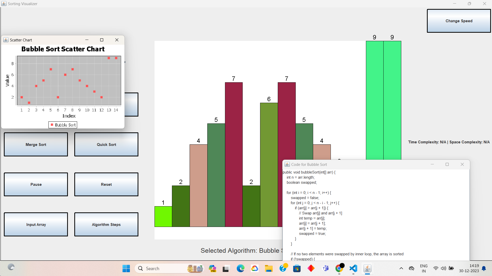

# Sorting Visualizer in Java
Welcome to the Sorting Visualizer! This Java application allows you to visualize the working of four sorting algorithms: Bubble Sort, Merge Sort, Insertion Sort, and Quick Sort. The visualization is presented through bar graphs and scatter charts, providing an intuitive understanding of how these algorithms operate.

## Features
1. Sorting Algorithms
Bubble Sort: A simple comparison-based sorting algorithm that repeatedly steps through the list, compares adjacent elements, and swaps them if they are in the wrong order.
Merge Sort: A divide-and-conquer algorithm that divides the array into two halves, recursively sorts them, and then merges the sorted halves.
Insertion Sort: Builds the final sorted array one item at a time, iteratively taking each element and placing it in its correct position.
Quick Sort: A divide-and-conquer algorithm that works by selecting a 'pivot' element and partitioning the other elements into two sub-arrays according to whether they are less than or greater than the pivot.
2. Visualization
Bar Graph: Represents the elements to be sorted as bars on a graph, with the height indicating their value.
Scatter Chart: Illustrates the changes in the elements' positions during the sorting process.
3. Adjustable Parameters
Speed Control: Adjust the speed of the visualization to observe the sorting process at different rates.
Algorithm Selection: Choose which sorting algorithms to visualize.
Code Display: Toggle the display of algorithmic code to understand the inner workings.
4. Input Data
Custom Input: Provide your own set of data for sorting.
## Getting Started
Prerequisites
Java Development Kit (JDK) installed on your machine.
Running the Application
Clone this repository to your local machine.

bash
Copy code
git clone https://github.com/your-username/sorting-visualizer-java.git
Navigate to the project directory.

bash
Copy code
cd sorting-visualizer-java
Compile and run the application.

bash
Copy code
javac SortingVisualizer.java
java SortingVisualizer
Usage
Upon running the application, you'll be presented with a graphical user interface (GUI) allowing you to customize and visualize the sorting algorithms.

Adjust the parameters using the sliders and checkboxes.

Click the "Start" button to initiate the visualization.

Observe the sorting process through the graphical representation.

Experiment with different inputs, speeds, and algorithms to gain insights into the functioning of each sorting algorithm.

## Contributing
Contributions are welcome! If you find any issues or have suggestions for improvement, feel free to create a pull request.

## License
This project is licensed under the MIT License - see the LICENSE file for details.

## Photo

